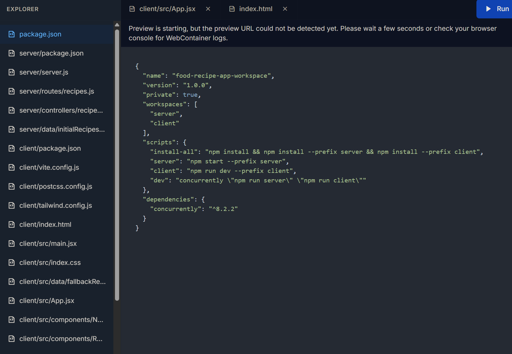

# 🤖 CodeSmith - AI Software Engineer Workspace

An autonomous AI coding workspace powered by Google Gemini and WebContainer.
This AI assistant can understand tasks, generate code, debug issues, explain logic, and assist developers in real-time.

---

## 🚀 Features

* 💬 AI-powered conversational coding assistant
* 🧠 Powered by Google Gemini API
* 🛠️ Code generation and debugging
* 📂 File understanding and project analysis
* 🌐 Web-integrated responses
* ⚡ Real-time chat interface
* 🧩 Multi-language(coding) programming support
* 🔍 Error explanation and fixes
* 📜 Clean and modern UI

---

## 🧠 Tech Stack

* **Frontend:** React / Next.js
* **Backend:** Node.js / Express
* **AI Model:** Google Gemini API
* **Database:** MongoDB / Firebase
* **Authentication:** JWT / Firebase Auth
* **Deployment:** Vercel / Render 

---

## 📸 Screenshots

*Add screenshots of your chatbot UI here.*


---

## ⚙️ Installation

Clone the repository:

```bash
git clone https://github.com/your-username/your-repo-name.git
cd your-repo-name
```

Install dependencies:

```bash
npm install
```

Create a `.env` file and add your Gemini API key:

```env
GEMINI_API_KEY=your_api_key_here
```

Start the development server:

```bash
npm run dev
```

---

## 🔑 Getting Gemini API Key

1. Go to Google AI Studio
2. Create an API key
3. Paste it into your `.env` file

---

## 📌 Usage

* Ask coding-related questions
* Generate full code snippets
* Debug errors
* Explain algorithms
* Build projects faster with AI assistance

Example:

```bash
"Create a responsive login page using React and Tailwind CSS"
```

---

## 🏗️ Project Structure

```bash
├── frontend/
├── backend/
├── components/
├── routes/
├── services/
├── utils/
└── README.md
```

---

## 🌟 Future Improvements

* Voice assistant support
* Terminal command execution
* Autonomous task handling
* GitHub repository integration
* AI memory and context storage
* Multi-agent workflow system

---

## 🤝 Contributing

Contributions are welcome!

1. Fork the repository
2. Create a new branch
3. Commit your changes
4. Push to your branch
5. Open a Pull Request

---

## 📄 License

This project is licensed under the MIT License.

---


Made with ❤️ Nikhil Rai

If you like this project, give it a ⭐ on GitHub!
